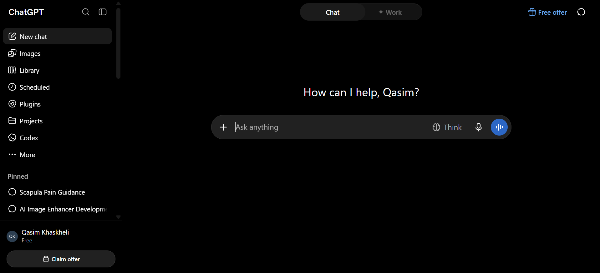
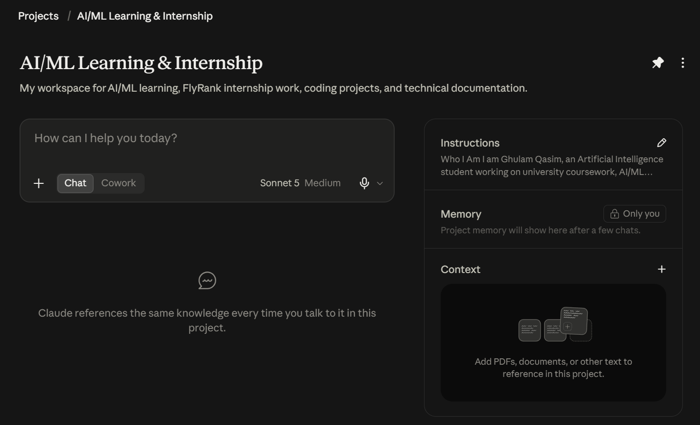
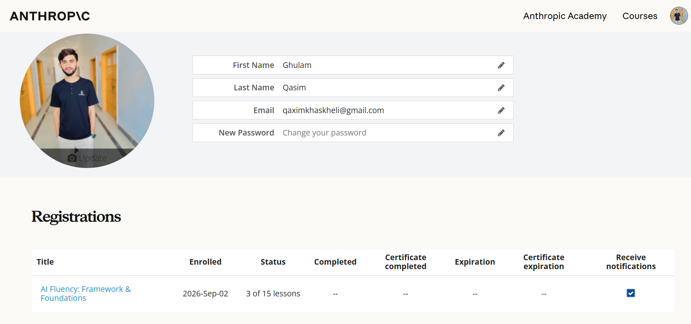
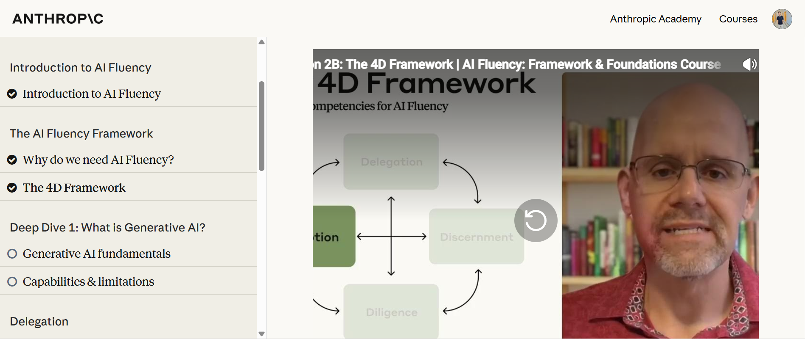

# AI Workflow Audit & Tool Setup (FL-01)

**Track**: General AI Fluency  
**Phase**: Setup & Foundations  
**Intern**: Ghulam Qasim (FlyRank Machine Learning & AI Fluency Intern)  
**Email**: qaximkhaskheli@gmail.com  

---

## 📌 Executive Summary

This document presents the complete **AI Workflow Audit & Tool Setup** for **Ghulam Qasim** as part of the FlyRank AI Fluency Internship. It maps recurring technical tasks, classifies AI interaction modes (Delegation, Description, Discernment, Diligence), establishes 3 target production workflows, and verifies account setup across primary AI build tools and the Anthropic Academy framework.

---

## 1. 📊 AI Workflow Audit & Task Mapping

As a Machine Learning & AI Engineering intern, daily activities are categorized to maximize productivity using AI build partners.

| Task Category | Recurring Activity | AI Interaction Mode | Target AI Tool | Measurable Success Criteria |
| :--- | :--- | :--- | :--- | :--- |
| **Code Optimization** | Refactoring PyTorch/TensorFlow pipelines & FastAPI endpoints | **Delegation & Discernment** | Claude 3.5 Sonnet / Codex | 40% reduction in debug time; zero syntax/lint errors |
| **Research Synthesis** | Analyzing ML papers, RAG architectures, and library docs | **Description & Diligence** | Perplexity AI & Gemini | Concise executive summaries with verified citations |
| **System Specs** | Drafting sitemaps, system specs, and workflow diagrams | **Delegation & Description** | Claude Project Workspace | Clean, minimalist specs aligned with primary CTAs |

---

## 2. 🎯 Three Target Production Workflows

### Workflow 1: Production Code Refactoring & MLOps Pipeline Optimization
- **Input**: Raw Python ML model script or data preprocessing notebook.
- **AI Action**: Refactor into modular, PEP-8 compliant, asynchronous microservice modules with docstrings and unit test suites.
- **Human Verification**: Code review, boundary testing, and execution in local environment.

### Workflow 2: Context-Aware Research & Document Synthesis
- **Input**: Large research papers or documentation PDFs.
- **AI Action**: Extract core algorithm mechanics, complexity bounds, and implementation trade-offs into structured markdown artifacts.
- **Human Verification**: Cross-referencing mathematical formulas and API signatures.

### Workflow 3: Portfolio Sitemap & Architectural Pressure-Testing
- **Input**: Raw portfolio ideas, user journeys, and target conversion goals.
- **AI Action**: Pressure-test sitemap nodes against target persona and primary CTA to eliminate vanity pages.
- **Human Verification**: Final design decision and visual diagramming.

---

## 3. 🛠️ AI Toolkit Setup & Proof of Accounts

### 📸 Proof 1: ChatGPT Account Setup
Account registered under **Qasim Khaskheli** (Free Tier). Utilized for multi-modal testing, quick code validation, and prompt benchmarking.

---

### 📸 Proof 2: Claude Project Creation (`AI/ML Learning & Internship`)
Claude Project initialized as primary build partner with custom system prompt instructions framing the AI as a technical tutor.

**Workspace Name**: `AI/ML Learning & Internship`  
**Description**: *"My workspace for AI/ML learning, FlyRank internship work, coding projects, and technical documentation."*

---

## 4. 🎓 Anthropic Academy Registration & 4D Framework Progress

### 📸 Proof 3: Official Anthropic Academy Enrollment
Verified profile registration under **Ghulam Qasim** (`qaximkhaskheli@gmail.com`) for the official course **"AI Fluency: Framework & Foundations"**.

---

### 📸 Proof 4: Active Learning Progress (The 4D Framework)
Active completion of foundational modules covering **Delegation, Description, Discernment, and Diligence**.

---

## ✅ Audit Verification Checklist

- [x] **Task Mapping Complete**: Mapped routine, cognitive, and creative engineering tasks.
- [x] **Target Workflows Defined**: 3 core workflows specified with clear inputs, AI actions, and human verification steps.
- [x] **Primary AI Tools Set Up**: ChatGPT & Claude workspace active with custom instructions.
- [x] **Anthropic Academy Progress**: Registered and actively completing the 4D AI Fluency curriculum.