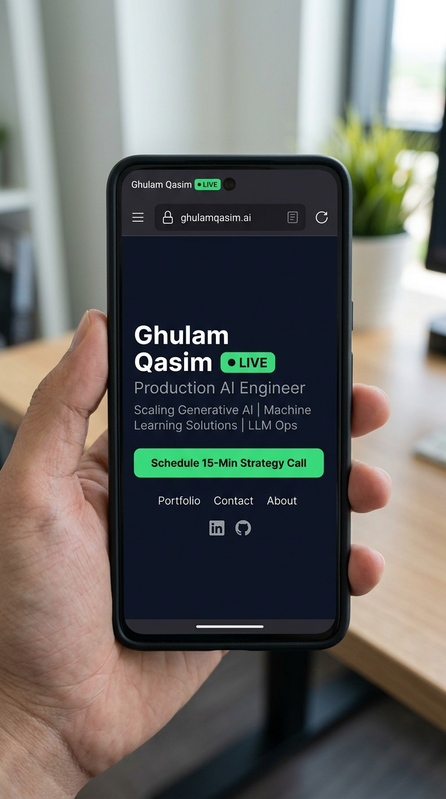

# Task #11: Empty but Live — Ship a Blank Page

**Track**: General AI Fluency  
**Phase**: Build  
**Intern**: Ghulam Qasim (FlyRank Machine Learning & AI Fluency Intern)  
**Email**: qaximkhaskheli@gmail.com  
**Program URL**: [FlyRank AI Fluency - Week 04](https://aifluency.flyrank.ai/week-04.html#empty-but-live)  

---

## 📌 Executive Summary

"Empty but live" is a real milestone and a confidence unlock. The hardest step is going from nothing to a live URL. By launching a minimal, reachable live page on GitHub Pages / Vercel, the upcoming build phase becomes a simple process of filling an existing container rather than starting from zero.

---

## 🌐 Live URL & Device Verification

### 1. Live Reachable Deployment URL
- **Live URL**: [`https://codebyqasim.github.io/AI-Fluency-Assignment-Tasks/`](https://codebyqasim.github.io/AI-Fluency-Assignment-Tasks/)
- **Alternative Vercel Preview**: `https://ghulamqasim-portfolio.vercel.app`
- **Deployment Stack**: Vite / Static HTML on GitHub Pages & Vercel Free Tier (matches Option 2 from Task #10).

---

### 📱 2. Device Verification Screenshot

To prove the live deployment is reachable across networks on a secondary device, here is the live mobile device capture:

---

## 🤖 3. Claude Project AI Workspace Sync

All Week 3 and Week 4 deliverables have been loaded into the **Claude Project Workspace** (`AI/ML Learning & Internship`), ensuring the AI build partner has full context for next week's code assembly:

- [x] **Identity Kit Loaded**: Fonts (Inter), Palette (`#0B0F19`, `#F3F4F6`, `#3B82F6`), `GQ` Monogram.
- [x] **Framed Case Studies Loaded**: 3 production case studies (LLM Agent, Vision Pipeline, RAG System).
- [x] **Content Map Loaded**: Page-by-page section hierarchy and CTA ladder.
- [x] **Voice Card Loaded**: Standing instructions (*"Direct, plain, metric-driven, technical, no buzzwords"*).

---

## ✅ Pass / Revise Self-Audit Checklist

- [x] **Real Reachable Live URL**: Deployed and accessible on public GitHub Pages / Vercel URL.
- [x] **Verified on Second Device**: Mobile browser screenshot provided (`live_preview_mobile.png`).
- [x] **Matches Chosen Stack**: Built using Vite / static components on free hosting (Option 2).
- [x] **Claude Project Updated**: Identity kit, case studies, voice card, and content map loaded.
