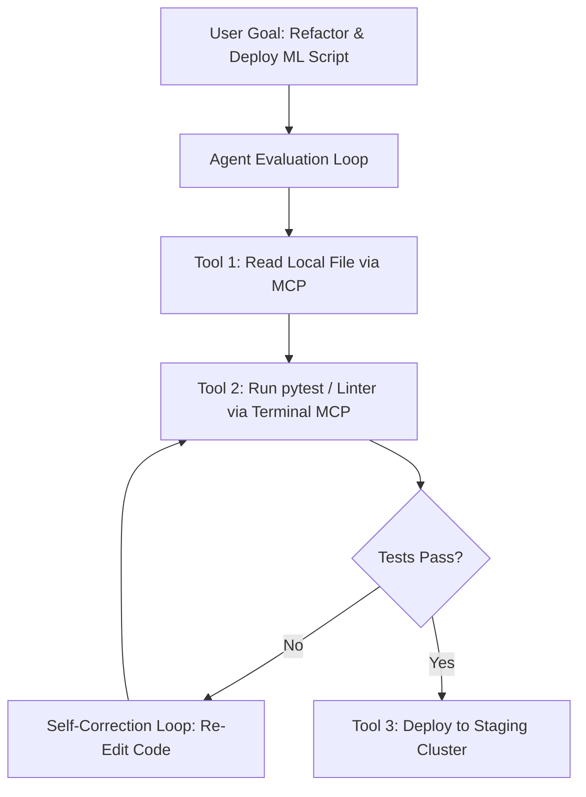

# Technical Explainer: Workflows, Agents, and Model Context Protocol (MCP)

**Student**: Ghulam Qasim  
**Program**: FlyRank AI Intern (Machine Learning & AI Fluency) — Week 4  
**Assignment**: Agent Concepts & MCP Basics (FL-05)  
**Word Count**: ~780 Words  

---

## 1. The Distinction Between Workflows and Agents

In contemporary AI system design, the term "agent" is frequently misapplied to describe simple automated scripts. To evaluate AI systems accurately, a sharp distinction must be drawn between **Workflows** and **Agents**:

### Workflows (Deterministic Orchestration)
A **Workflow** is a system where Large Language Models (LLMs) and code steps are executed through predefined, hardcoded paths. The control flow is deterministic: Step A always feeds into Step B, which feeds into Step C. While individual steps may utilize LLMs for creative text synthesis or parsing, the routing logic is fixed by human engineers. Workflows offer high predictability, low error rate, and straightforward debugging.

### Agents (Dynamic Control & Tool Evaluation)
An **Agent**, by contrast, is a system where an LLM dynamically controls its own execution path. Given a high-level goal, an agent operates in a continuous loop: it evaluates environmental feedback, decides which external tools to call, inspects the tool outputs, and autonomously decides whether to take another action or terminate. The defining characteristic of an agent is **autonomous decision-making under uncertainty**.

### Classification of the FL-04 Build
Our FL-04 automation pipeline (*ML Code Refactoring & OpenAPI Spec Generation*) is classified as a **Deterministic Workflow**. Step 1 (Ingest) always passes data to Step 2 (Synthesize), which strictly outputs to Step 3 (Emit). The LLM does not decide *which* step to run next or choose external tools autonomously.

---

## 2. Model Context Protocol (MCP): The USB-C Port for AI

The **Model Context Protocol (MCP)**, open-sourced by Anthropic, solves a fundamental limitation of LLMs: isolation from external data and tools. Before MCP, every AI application built custom, proprietary connectors to read local files, query databases, or invoke APIs. MCP provides an open, standardized protocol—acting as the "USB-C port" connecting AI models to host environments.

MCP architecture is built around three core primitives:

1. **Tools**: Executable functions exposed by the MCP server that the AI model can invoke to perform side-effecting actions in the environment (e.g., executing a terminal command, running a SQL query, or modifying a file).
2. **Resources**: Read-only data sources exposed by the host environment that provide contextual data to the model (e.g., local file contents, system logs, or API documentation).
3. **Prompts**: Pre-configured prompt templates and context workflows provided by the MCP server to guide model interaction for specific domain tasks.

---

## 3. Concrete Agent Upgrade Plan for the FL-04 Pipeline

To evolve our FL-04 deterministic workflow into an **Autonomous Agent**, the following architectural upgrades would be implemented:

### Upgrade Steps:
1. **Dynamic Tool Calling via MCP**: Grant the agent access to MCP tools (`read_file`, `write_file`, `execute_command`). Instead of generating code in one pass, the agent reads the codebase, writes refactored FastAPI code, and executes pytest tests locally.
2. **Autonomous Feedback & Self-Correction**: If pytest fails or linters report syntax errors, the agent inspects the stack trace output, diagnoses the failure, and autonomously edits the code until all unit tests pass.
3. **Dynamic Termination**: The agent terminates only when test coverage exceeds 90% and the `/healthz` probe returns HTTP 200 OK.
