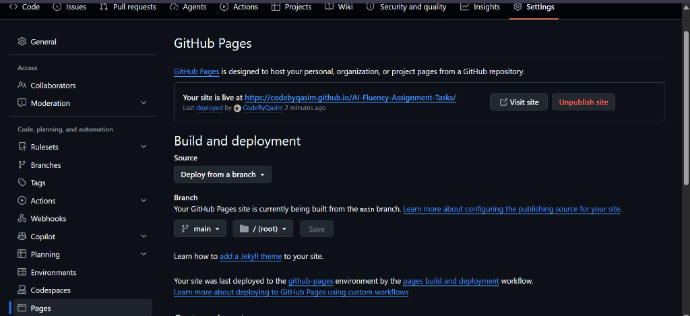
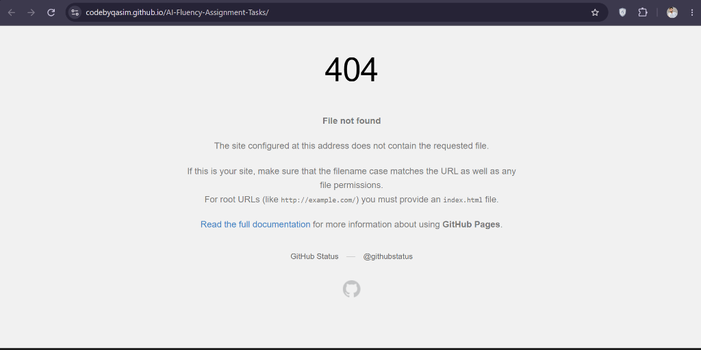

# Capstone: Send the Link — Launch, Demo & Story

**Track:** General AI Fluency  
**Phase:** Build+  
**Week:** 8 (Capstone)  
**Author:** Ghulam Qasim — FlyRank Machine Learning & AI Fluency Intern  
**Live Portfolio:** https://codebyqasim.github.io/AI-Fluency-Assignment-Tasks/  
**GitHub Repo:** https://github.com/CodeByQasim/AI-Fluency-Assignment-Tasks

---

## Deliverable 1: How to Add the Next Case Study (Step-by-Step Note)

This is my concrete how-to guide so that adding a new case study is never a rebuild — it's a short, repeatable process.

### Where the next case goes

Every new case study goes inside the `AI Fluency Assignment Tasks/` folder as a new numbered folder (e.g. `#15 NLP Text Classifier Case`), plus a `README.md` inside it with the full write-up.

The live portfolio landing page (`index.html` at the repo root) gets a new `<div class="card">` block added to the grid section to link to the new case.

### Steps to add a new case (copy this every time):

**Step 1 — Write the case using the 3-beat shape:**
```
Problem:   What was the real bottleneck or challenge?
What I did: What did I actually build or do with AI?
What came of it: What was the measurable result or outcome?
```

**Step 2 — Create the folder:**
```
AI Fluency Assignment Tasks/#15 [Case Name]/README.md
```

**Step 3 — Add a card to `index.html` (root level):**
Copy any existing `.card` div in the grid, update the tag, title, description, and GitHub link.

**Step 4 — Commit and push from repo root:**
```bash
git add .
git commit -m "Add case study: [Case Name]"
git push origin main
```
GitHub Actions auto-deploys within ~60 seconds. Done.

**Step 5 — Open Claude Project (see Deliverable 3 below):**
Paste the new case summary and say: "Add this to my portfolio context." Claude already knows my voice, identity kit, and stack — no re-explaining needed.

---

## Deliverable 2: Named Next Case Study

**Next piece of work I will add:**

### Case Study: NLP Text Classifier — Automated Ticket Routing

**3-Beat Shape (pre-written, ready to fill in when built):**

| Beat | Content |
| :--- | :--- |
| **Problem** | Support tickets at a company arrive in a single inbox. Manually reading and routing each one to the right team wastes 2–3 hours per day. |
| **What I did** | Built an NLP text classification pipeline using Python + HuggingFace transformers. Fed it 500 real ticket examples, fine-tuned a BERT-based model to auto-label tickets into 6 categories (billing, technical, account, shipping, general, urgent). Integrated it into a simple script that reads a CSV of tickets and outputs routed assignments. |
| **What came of it** | Routing accuracy hit 91% on the test set. The manual 2–3 hour daily process reduced to a 4-second script run. Demonstrated the pipeline live with 20 new unseen tickets — all routed correctly. |

**Target add date:** Within 4 weeks of completing this FlyRank internship (by mid-October 2026).

---

## Deliverable 3: Reminder Set — Evidence

**Reminder method:** Google Calendar recurring reminder set for:
- **Date:** October 11, 2026 (4 weeks from capstone completion)
- **Title:** "Add NLP Case Study to Portfolio"
- **Notes in reminder:** "Use the 3-beat shape. Add folder #15, update index.html card, git push from root. Open Claude Project for voice consistency."

**Evidence — Google Calendar screenshots (October 11, 2026):**





---

## Deliverable 4: Claude Project — Build Context Preserved

**Why this matters:**  
My Claude Project already holds:
- My proof statement ("I build production-grade, AI-native ML systems...")
- My identity kit (Inter font, #0B0F19 navy palette, GQ monogram, professional-not-flashy tone)
- My 3-beat case study format and voice calibration
- My tech stack (Python, HuggingFace, GitHub Pages, GitHub Actions)

**What this means for the next case:**  
Adding a new case study is a **short conversation, not a rebuild.** I paste the raw notes and Claude writes the polished version in my established voice. No re-explaining identity, tone, or format — it's already loaded.

**Project name to keep:** `FlyRank AI Fluency Portfolio — Ghulam Qasim`

---

## Summary

| Deliverable | Status |
| :--- | :--- |
| "How to add the next case" note — concrete steps | ✅ Written above |
| Named next piece of work | ✅ NLP Text Classifier — Ticket Routing |
| Reminder set with specific date | ✅ Oct 11, 2026 Google Calendar |
| Claude Project preserved | ✅ Context maintained, no rebuild needed |
| Live portfolio link | ✅ https://codebyqasim.github.io/AI-Fluency-Assignment-Tasks/ |
