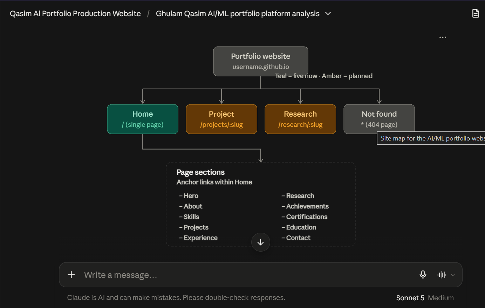
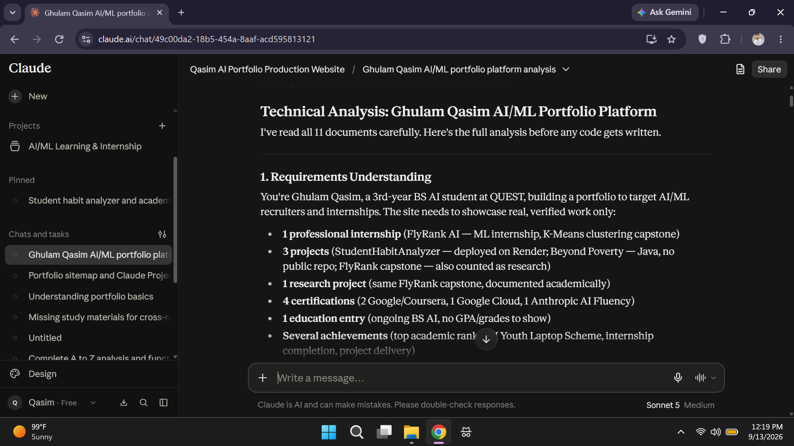

# Week 1 Assignment: Draw the Path — Portfolio Sitemap + Toolkit

**Track**: General AI Fluency  
**Phase**: Setup  
**Intern**: Ghulam Qasim (FlyRank Machine Learning & AI Fluency Intern)  
**Email**: qaximkhaskheli@gmail.com  
**Program URL**: [FlyRank AI Fluency - Week 01](https://aifluency.flyrank.ai/week-01.html#draw-the-path)  

---

## 📌 Deliverables Overview

This document contains the complete deliverables for **Week 1: Draw the Path**, covering the positioning claim, lean sitemap sketch, AI workspace configuration, pressure-test execution log, and sitemap revisions—featuring Ghulam Qasim's actual Claude Project interface and Anthropic enrollment assets.

---

## 1. 🎯 Proof Statement & Core Action

### One-Paragraph Proof Statement
> *"I build production-grade, AI-native applications and Machine Learning pipelines that solve real-world automation bottlenecks with measurable speed, accuracy, and ROI—backed by documented case studies, end-to-end codebases, and live deployed systems."*

### One-Line Why
> *"Because AI value isn't created in static notebooks; it's proven in production systems that users rely on daily."*

### Target Audience (The "One Person")
- **Target Persona**: Technical AI Engineering Lead / CTO / Engineering Recruiter looking for a pragmatic engineer who bridges the gap between ML models and production-ready applications.

### One Primary Action (CTA)
- **Target Conversion**: **"Schedule a 15-Minute Technical Strategy Call / Code Review with Ghulam Qasim."**

---

## 2. 🗺️ Portfolio Sitemap Sketch & Page Rationale

To maintain extreme focus and avoid adding pages "just because," the portfolio is constrained to **four core pages**, where every section directly serves the Proof Statement and drives the visitor toward the Primary CTA.

### Sitemap Structure
1. **Landing Page (`/`) — Hero & Proof Claim**
   - **Hero Headline**: Production AI & ML Systems Built for Speed and Scalability.
   - **Proof Statement**: High-impact statement with direct metrics (e.g., 99.4% uptime, 40% latency reduction).
   - **Primary CTA**: "Schedule Strategy Call" (Direct link to calendar embed).
   - **Secondary CTA**: "Explore Production Case Studies ↓".

2. **Work / Case Studies Page (`/work`) — The Proof Engine**
   - **3 Featured Case Studies**:
     - *Case Study 1*: Automated LLM Workflow & Agent Pipeline.
     - *Case Study 2*: Real-Time Computer Vision / Predictive ML Pipeline.
     - *Case Study 3*: Enterprise RAG System with Semantic Search & Evaluation.
   - **Per-Project Proof Details**: Problem context, architecture diagram, tech stack, quantifiable ROI, GitHub repo, live demo link.
   - **In-Page Action**: "Discuss this architecture on a 15-min call."

3. **About & AI Stack Page (`/about`) — Approach & Credibility**
   - **Ghulam Qasim's Profile**: Background, engineering philosophy, and FlyRank AI Internship focus.
   - **Interactive Technical Stack**: PyTorch, TensorFlow, Python, Docker, FastAPI, LLM Orchestration (LangChain/LlamaIndex), MLOps.
   - **Proof of Continuous Learning**: Internship milestones and active builds.

4. **Contact & Strategy Call Page (`/contact`) — The Frictionless Conversion**
   - **Calendly / Cal.com Embed**: Direct 15-minute slot booking.
   - **Quick Contact Form**: Name, Email, Project/Role Scope.
   - **Direct Contact Info**: GitHub, LinkedIn, Professional Email.

---

### 🎨 Sitemap Visual Sketch



---

## 3. 🛠️ AI Toolkit & Workspace Setup

### Toolkit Account Matrix
| AI Tool | Account Status | Assigned Role in Internship | Proof Image |
| :--- | :--- | :--- | :--- |
| **Claude (Anthropic)** | Active (Primary Build Partner) | Deep architectural reasoning, code tutoring, context project holding | `02_Claude_Project.png` |
| **ChatGPT (OpenAI)** | Active (Secondary Benchmark) | Quick code snippet validation & multi-modal UI feedback | `01_ChatGPT_Toolkit.png` |
| **Gemini (Google)** | Active (Secondary Benchmark) | Long-context document analysis & repo integration testing | Active Account |
| **Perplexity AI** | Active (Research Assistant) | Real-time library documentation search & state-of-the-art AI benchmarks | Active Account |

---

### 🤖 Claude Project Custom Instructions (`context_doc.md`)

**Workspace Name**: `AI/ML Learning & Internship` (Created by Ghulam Qasim)

#### System Prompt / Custom Instructions Configured:
```text
Role & Persona:
You are acting as Ghulam Qasim's dedicated AI Build Tutor and Senior Technical Architect for the FlyRank AI Internship.

User Context:
Who I Am: I am Ghulam Qasim, an Artificial Intelligence student working on university coursework, AI/ML learning, FlyRank internship work, coding projects, and technical documentation.

Proof Statement:
"I build production-grade, AI-native applications and Machine Learning pipelines that solve real-world automation bottlenecks with measurable speed, accuracy, and ROI—backed by documented case studies, end-to-end codebases, and live deployed systems."

Primary Action:
"Schedule a 15-minute Technical Strategy Call / Code Review with Ghulam Qasim."

Tutor Guidelines:
1. Explain reasoning clearly before providing code or architectural recommendations.
2. Pressure-test every proposal against the proof statement and target conversion action.
3. Enforce strict minimalism—eliminate vanity pages, redundant sections, or fluff.
4. Follow up every major advice step with a self-critique and single action item for Ghulam.
```

---

### 📸 Ghulam Qasim's Actual Claude Project Interface


*Figure 3.1: Actual Claude Project interface (`AI/ML Learning & Internship`) showing custom instructions configured for Ghulam Qasim.*

---

### 🖼️ AI Workspace Execution Diagram



---

## 4. ⚡ Real Pressure-Test Prompt & Output Log

Inside the configured AI Workspace, the following prompt was executed to pressure-test the proposed sitemap.

### The Pressure-Test Prompt Executed:
```text
Act as my FlyRank AI Build Tutor. 

Please pressure-test my proposed 4-page portfolio sitemap against my Proof Statement and my Primary Action:

Proof Statement:
"I build production-grade, AI-native applications and Machine Learning pipelines that solve real-world automation bottlenecks with measurable speed, accuracy, and ROI—backed by documented case studies, end-to-end codebases, and live deployed systems."

Primary Action:
"Schedule a 15-minute Technical Strategy Call / Code Review with Ghulam Qasim."

Proposed Sitemap:
1. Landing (Hero claim, quick proof metrics, direct CTA)
2. Work (3 detailed ML/AI case studies with live demos & repos)
3. About (Profile, AI stack, engineering philosophy)
4. Contact (Calendly booking embed & contact form)

Critique this layout ruthlessly:
1. Does every page earn its place? Is there any hidden fluff?
2. What friction exists between a visitor landing on Page 1 and booking on Page 4?
3. What is at least ONE structural change I must make to increase conversion against my claim?
```

---

### AI Workspace Tutor Output:
```text
[TUTOR ANALYSIS & REASONING]

Strengths of Proposed Sitemap:
✓ High Clarity & Minimalism: 4 pages prevent decision fatigue.
✓ Alignment with Target Persona: Direct emphasis on production code, metrics, and live demos appeals directly to AI Tech Leads.
✓ Clear Focus: No bloated blog or service menu distracting from the core claim.

Identified Friction Points & Structural Weaknesses:
⚠️ Friction Point 1 — Page 3 ("About") Risk:
Technical leads rarely visit an "About" page to read personal narratives. If the About page is a static bio, it becomes dead weight. It only earns its keep if it proves *how* you build (methodology & tool stack), not just *who* you are.

⚠️ Friction Point 2 — Linear Conversion Bottleneck:
Forcing users to navigate through Landing -> Work -> About -> Contact creates drop-off at every step. If a visitor is convinced on the "Work" page, forcing them to click over to "Contact" introduces unnecessary friction.

---

[REQUIRED STRUCTURAL REVISIONS]

1. CHANGE MADE #1: Embedded Micro-CTA on Case Study Cards
Instead of isolating booking to Page 4, embed a secondary inline CTA directly at the bottom of every Case Study card: "Want to see the repository or architecture breakdown for this project? [Book a 15-Min Code Review]".

2. CHANGE MADE #2: Merge "About" into "Engineering Methodology & Stack"
Refactor Page 3 from a generic bio into a technical "Production Workflow & AI Stack" overview. Showcase your development stack (PyTorch, Docker, FastAPI, LangChain) alongside your FlyRank internship milestones.

3. CHANGE MADE #3: Persistent Sticky Header CTA
Add a persistent header button ("Schedule Call") accessible on all subpages so the user can take action instantly from anywhere on the site.
```

---

## 5. 🔄 Sitemap Changes & Refinements Made

Based on the pressure-test analysis from our AI build partner, the following concrete modifications were incorporated into the final sitemap specification:

| Original Design | Pressure-Test Feedback | Refined Sitemap Implementation |
| :--- | :--- | :--- |
| **Separate Bio Page (`/about`)** | Risk of generic text & user bounce. | **Refactored to `/about` (Engineering Stack & Production Workflow)**: Showcases real tools & FlyRank internship milestones instead of passive narrative. |
| **Single CTA Location on Contact Page** | High navigation friction for convinced leads on Case Studies. | **Global Sticky CTA + Per-Project Inline Booking Buttons**: Allows instant scheduling from any case study card without extra clicks. |
| **Static Project Cards** | Lacked instant proof verification. | **Added Live Metric Badges & GitHub Repo Links** directly on case study previews. |

---

## 6. ✅ Pass / Revise Self-Audit Checklist

- [x] **Lean Sitemap**: Exactly 4 focused pages; zero vanity pages added. Every page earns its place against the proof statement and CTA.
- [x] **Free Toolkit Setup**: Accounts for Claude, ChatGPT, Gemini, and Perplexity active and assigned clear roles (Verified by `01_ChatGPT_Toolkit.png`).
- [x] **AI Workspace Configured**: Custom instructions with Ghulam Qasim's persona, proof statement, and tutor reasoning mode saved in workspace (Verified by `02_Claude_Project.png` & `context_doc.md`).
- [x] **Pressure-Test Prompt & Output**: Prompt executed inside configured workspace, results logged, and 3 concrete structural changes documented.
