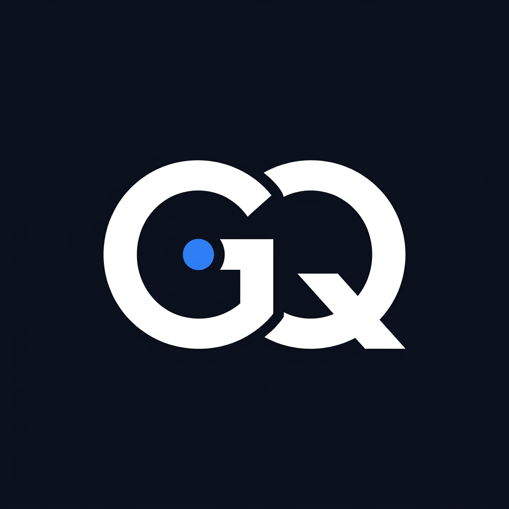

# Task #7: Decide Once — Build Your Identity Kit

**Track**: General AI Fluency  
**Phase**: Foundations  
**Intern**: Ghulam Qasim (FlyRank Machine Learning & AI Fluency Intern)  
**Email**: qaximkhaskheli@gmail.com  
**Program URL**: [FlyRank AI Fluency - Week 03](https://aifluency.flyrank.ai/week-03.html#identity-kit)  

---

## 📌 Executive Summary

A consistent look separates a portfolio that feels intentional from one that feels thrown together. By deciding typography, color palette, logo, and mood once, every page and case study inherits a cohesive visual language where the design frames the work without competing for attention.

---

## 🎨 Identity Kit One-Page Summary

### 1. Typography
- **Heading Font**: Inter (700 Bold, line-height 1.2)
- **Body Font**: Inter (400 Regular, 16px base, line-height 1.6)

---

### 2. Color Palette & Hex Codes

| Color Purpose | Hex Code | Visual Description | Usage Boundary |
| :--- | :--- | :--- | :--- |
| **Main Canvas Background** | `#0B0F19` | Deep Dark Navy | Dominant background for all pages |
| **Card & Container BG** | `#1F2937` | Charcoal Gray | Case study cards, code blocks, borders |
| **Primary Text** | `#F3F4F6` | Near-White | High-contrast readable body & headers |
| **Muted Metadata Text** | `#9CA3AF` | Slate Gray | Subtitles, dates, tags |
| **Accent & CTA** | `#3B82F6` | Calm Electric Blue | Buttons, links, active state indicators |

---

### 3. Logo & Favicon Monogram

The logo is a minimalist monogram of **GQ** set in Inter Bold typography with a subtle electric blue accent dot.



---

### 4. Standing 2-Line Style Note (Claude Project Context)

```text
Visual Style Guide for Ghulam Qasim:
Use an ultra-clean dark navy palette (#0B0F19 background, #F3F4F6 text, #3B82F6 electric blue accent) with Inter typography. 
Keep all visual framing calm and minimalist so that production code snippets, architecture diagrams, and ROI metrics remain the focus of the page.
```

---

## ✅ Pass / Revise Self-Audit Checklist

- [x] **Fonts Selected**: Clean typography (Inter for headings and body).
- [x] **Tight Palette with Hex Codes**: 4 colors specified (`#0B0F19`, `#1F2937`, `#F3F4F6`, `#3B82F6`).
- [x] **Simple Logo / Favicon**: Created clean `GQ` monogram asset (`identity_logo.png`).
- [x] **2-Line Style Note**: Formulated and saved into project context.
