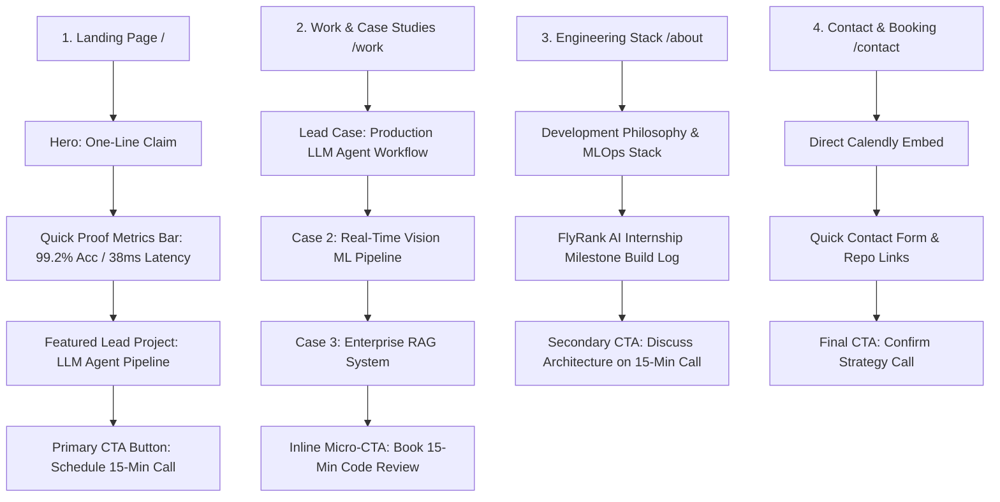

# Task #9: The Through-Line — Map Content & CTAs

**Track**: General AI Fluency  
**Phase**: Foundations  
**Intern**: Ghulam Qasim (FlyRank Machine Learning & AI Fluency Intern)  
**Email**: qaximkhaskheli@gmail.com  
**Program URL**: [FlyRank AI Fluency - Week 03](https://aifluency.flyrank.ai/week-03.html#the-through-line)  

---

## 📌 1. The Memorable One-Line Claim

> **"I build production-grade AI pipelines and Machine Learning applications that turn complex models into high-speed, reliable software."**

---

## 🗺️ 2. The Content & CTA Map

Every page has ordered sections, leads with the strongest proof, and ends with a call to action that ladders directly up to the primary CTA: **"Schedule a 15-Minute Technical Strategy Call / Code Review."**

### Detailed Section Breakdown

#### Page 1: Landing Page (`/`)
1. **Hero Section**: Monogram logo, One-line claim headline, brief proof statement.
2. **Proof Metrics Banner**: Key benchmarks (e.g., *99.2% extraction accuracy*, *38ms inference speed*, *42% support ticket reduction*).
3. **Featured Lead Case Preview**: Production LLM Agent Workflow & Automation.
4. **Primary CTA**: Button $\rightarrow$ `"Schedule 15-Minute Strategy Call"`.

#### Page 2: Work / Case Studies Page (`/work`)
1. **Case Study 1 (Lead)**: Production LLM Agent Workflow (Problem $\rightarrow$ Decisions $\rightarrow$ 4.2s benchmark).
2. **Case Study 2**: Real-Time Computer Vision & Predictive ML Pipeline (Problem $\rightarrow$ Decisions $\rightarrow$ 38ms latency).
3. **Case Study 3**: Enterprise RAG System (Problem $\rightarrow$ Decisions $\rightarrow$ 0.91 NDCG@5).
4. **CTA on Each Card**: Button $\rightarrow$ `"Review this code on a 15-min call"`.

#### Page 3: About & Engineering Stack (`/about`)
1. **Technical Stack Grid**: PyTorch, FastAPI, Docker, LangChain, Qdrant, Redis.
2. **FlyRank Internship Milestones**: Chronological build log of assignments & code repos.
3. **CTA**: Button $\rightarrow$ `"Schedule Strategy Call to discuss tech stack"`.

#### Page 4: Contact & Strategy Call (`/contact`)
1. **Calendly Booking Widget**: Direct 15-minute slot calendar.
2. **Direct Links**: GitHub, LinkedIn, Email.
3. **Final Action**: `"Book Strategy Slot"`.

---

## 📝 3. The "Still Need to Gather" Inventory

To ensure the upcoming build week isn't blocked, here is the honest list of assets and links still to be finalized:

| Asset Required | Current Status | Action to Finalize Before Build Week |
| :--- | :--- | :--- |
| **Calendly Live Booking URL** | Pending Embed | Set up free Calendly account for 15-min slots |
| **GitHub Repository Public Links** | Local Code | Push standalone project repos for Case Studies 1, 2, 3 |
| **Live API Demo Endpoints** | Local FastAPI | Deploy test endpoints on Render / Vercel |
| **Latency Benchmark Graphs** | Raw logs | Export clean latency line-chart graphics |

---

## ✅ Pass / Revise Self-Audit Checklist

- [x] **Single Memorable Claim**: One concise sentence stating what is proven.
- [x] **Ordered Content Map**: Every page has ordered sections, leads with strongest work, and names explicit CTAs.
- [x] **CTA Laddering**: All calls to action ladder up to the 15-minute strategy call.
- [x] **Honest Gather List**: Inventory of pending links, live endpoints, and repo cleanup documented.
